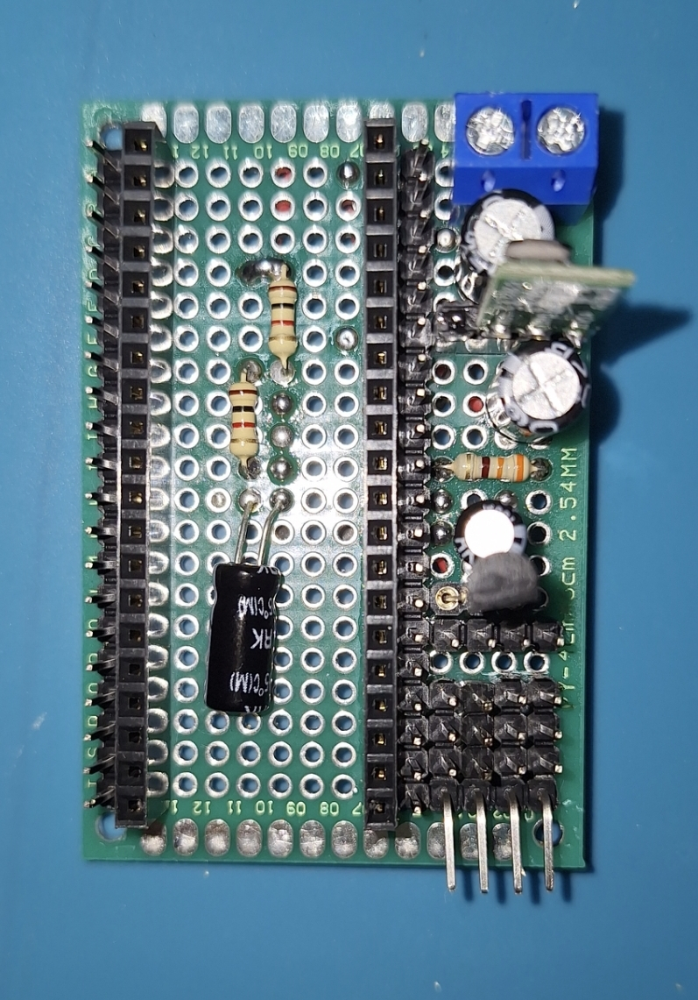

# PicoWeatherStation v3
off grid Raspberry Pi Pico W powered weather station with bme280 sensor + MPPT solar converter integration.

### Features
- temperature, humidity & pressure logging
- pv data logging
- built-in logger with log files date based rotation
- web API for communication
- built-in backup power supply

### The end of the road
Oh boy here we go, almost 2 years since my [first attempt](https://github.com/zNitche/PicoWeatherStation) to create this kind of weather station.

Well, 3rd iteration and hopefully the last one (if we're talking about logging just temperature, humidity and pressure), great place for complete project (projects?) summary, isn't it ?

### Previous interactions summary & key differences

#### [PicoWeatherStation](https://github.com/zNitche/PicoWeatherStation)
First attempt at outdoor IoT devices, station wasn't standalone by any mean:
   - device could be powered via built-in battery not longer than 2 days
   - in order to log data, the remote server has to be in range

after device was completed I left it running for 2 days, visualised gathered data and moved on,

there was no point in developing this prototype further.

#### [PicoWeatherStationV2](https://github.com/zNitche/PicoWeatherStationV2)
Second one was better planned, also its goals was more advanced.
This time it was meant to be fully standalone device powered by solar panels.

Initially it required some extra work, like developing [web framework](https://github.com/zNitche/strawberryAPI) for Raspberry Pico W to host web dashboard on.

When everything was ready I assembled station, mounted it on grapes frame in my garden and left it running. 

I was positively surprised when station lasted around 2 months before its solar panels stopped working (the became mat due to solar exposure). 

I gathered data, drew conclusions and moved on.

So what went wrong:
- Integrated solar panels couldn't produce enough power to keep station running. It wasn't an issue when
I tested it (in the middle of the summer) but when days start to get shorter It will be a big problem.
- integrated circuit I used for battery management has a big flaw, when the battery is completely discharged and then recharged,
the station will not turn on, manual restart is needed.
- CPU interrupts wasn't great for handling async tasks (this one is strawberryAPI related, but worth noticing).

### This project
2 iterations completed, lessons learned, it is time for the third and final one.

What is needed ? Well it is quite simple:
- Stable and expandable software.
- Good power source.
- Hardware without the defects of the previous ones.

Maybe not so simple. I got to work.

#### Power supply:
Some time ago I was able to buy relative cheap 300W solar panel + 12v AGM battery.
Combined with some aluminium profiles as a frame, fuses and MPPT solar regulator I was able to build powerful platform for my future off grid projects (including this one).

#### Software
strawberryAPI was a good start but as my software development skill grew I started noticing its limitations and that's 
when I decided to develop something new, lightberryAPI came to life.

I don't want to describe its features here, it can be found in project README, but the most needed improvement 
was complete overhauled background tasks system utilizing asyncio.

Despite web framework, environment sensor (bme280) & rtc (ds3231) libraries were needed. 
This and the research + PoC of MPPT solar converter integration took huge chunk of my free time.

Following repos are results of my work:
- [lightberryAPI](https://github.com/zNitche/lightberryAPI)
- [bme280](https://github.com/zNitche/pico-bme280/blob/master/bme280.py)
- [ds3231](https://github.com/zNitche/pico-rtc-ds3231/blob/master/ds3231.py)
- [MPPT solar converter](https://github.com/zNitche/mppt-solar-regulator-btle-communication)

#### Hardware
core of the system is as in the previous ones Rpi Pico W and that's where the similarities ends.
- temperature, pressure and humidity logging by bme280 sensor.
- used lm4040 3v reference diode for reducing adc noise.
- custom made [BMS](https://github.com/zNitche/SBPS)
- CCCV Step-Down converter for battery charging and power delivery.
- better Step-Up converter.

### The Future
What's the future of this project ? Honestly I don't know, at the moment I am writing this I have no plans to add new features, nor improve current ones.

It has been operating continuously for almost 3 months now, so I can call it my little success.

One last missing thing is some kind of dashboard to preview gathered data (instead of viewing json strings), 
but whether it will be a web based app (like I did in my another [project](https://github.com/zNitche/CrowsNest) utilizing lightberryAPI)
or a mobile app, I haven't decided yet.

### Media
#### Motherboard


#### Station assembled


#### Station mounted


#### Station mounted & sealed


### Parts
- Raspberry Pi Pico W
- [SBPS](https://github.com/zNitche/SBPS)
- lm4040 - 3V reference voltage diode
- Pololu U3V16F5 - 5v Step-Up converter
- DS3231 RTC i2c module
- microSD card reader SPI module
- 2x 470uF electrolytic capacitor
- 2x 100uF electrolytic capacitor
- 330Ω resistor
- 2x 1kΩ resistor
- XL4015E1 CCCV Step-Down converter 
- BME280
- Some connector wires
- Some goldpin stripes
- 2 Pin ARK connector
- 18650 Li-Ion battery
- 18650 battery holder
- IP56 150x110x70 container
- 2x cable gland

### Models for 3d printing
- `inner_frame.stl` - internal frame for mounting all core components.
- `station_holder.stl` - arm to mount station box on.
- `ws_bottom.stl` - bottom cover for weather sensor box.
- `ws_box.stl` - weather sensor box.
- `ws_box_holder.stl` - arm to mount weather sensor box on.

### Microcontroller requirements (frozen modules)

- [lightberryAPI v1.3.5](https://github.com/zNitche/lightberryAPI/releases/tag/v1.3.5)
- [bme280.py](https://github.com/zNitche/pico-bme280/blob/master/bme280.py)
- [ds3231.py](https://github.com/zNitche/pico-rtc-ds3231/blob/master/ds3231.py)
- [sdcard.py](https://github.com/micropython/micropython-lib/blob/v1.22.2/micropython/drivers/storage/sdcard/sdcard.py)

### Development
packages in `requirements.txt` are used for development

```
pip3 install -r requirements.txt
```

### Remote Shell
for flashing pico you can use `rshell`
```
pip3 install rshell==0.0.32
```

enter REPL
```
rshell 
repl
```

flash
```
rshell -f commands/flash
```

clear all files
```
rshell -f commands/wipe
```
