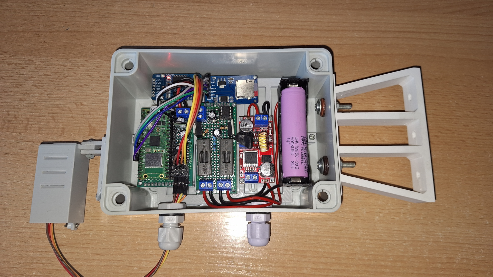
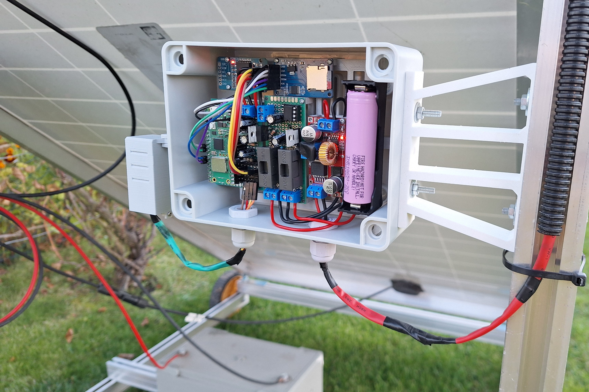
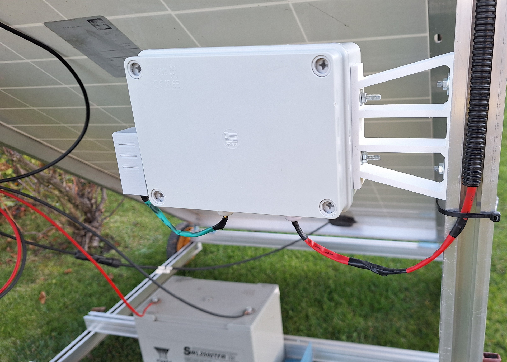

# PicoWeatherStation v3

### Microcontroller requirements (frozen modules)

- [lightberryAPI v1.3.5](https://github.com/zNitche/lightberryAPI/releases/tag/v1.3.5)
- [bme280.py](https://github.com/zNitche/pico-bme280/blob/master/bme280.py)
- [ds3231.py](https://github.com/zNitche/pico-rtc-ds3231/blob/master/ds3231.py)
- [sdcard.py](https://github.com/micropython/micropython-lib/blob/v1.22.2/micropython/drivers/storage/sdcard/sdcard.py)

### Media




### Parts
- Raspberry Pi Pico W
- [SBPS](https://github.com/zNitche/SBPS)
- lm4040 - 3V reference voltage diode
- Pololu U3V16F5 - 5v Step-Up converter
- DS3231 RTC i2c module
- microSD card reader SPI module
- 2x 470uF electrolytic capacitor
- 2x 100uF electrolytic capacitor
- 330Ω resistor
- 2x 1kΩ resistor
- XL4015E1 CCCV Step-Down converter 
- BME280
- Some connector wires
- Some goldpin stripes
- 2 Pin ARK connector
- 18650 Li-Ion battery
- 18650 battery holder
- IP56 150x110x70 container
- 2x cable gland

### Models for 3d printing
- `inner_frame.stl` - internal frame for mounting all core components.
- `station_holder.stl` - arm to mount station box on.
- `ws_bottom.stl` - bottom cover for weather sensor box.
- `ws_box.stl` - weather sensor box.
- `ws_box_holder.stl` - arm to mount weather sensor box on.

### Extra

### Development
packages in `requirements.txt` are used for development

```
pip3 install -r requirements.txt
```

#### Remote Shell
for flashing pico you can use `rshell`
```
pip3 install rshell==0.0.32
```

enter REPL
```
rshell 
repl
```

flash
```
rshell -f commands/flash
```

clear all files
```
rshell -f commands/wipe
```


### Notes (WIP)

```
+ (5v)

- | + (3.3v) | sda | scl
```
